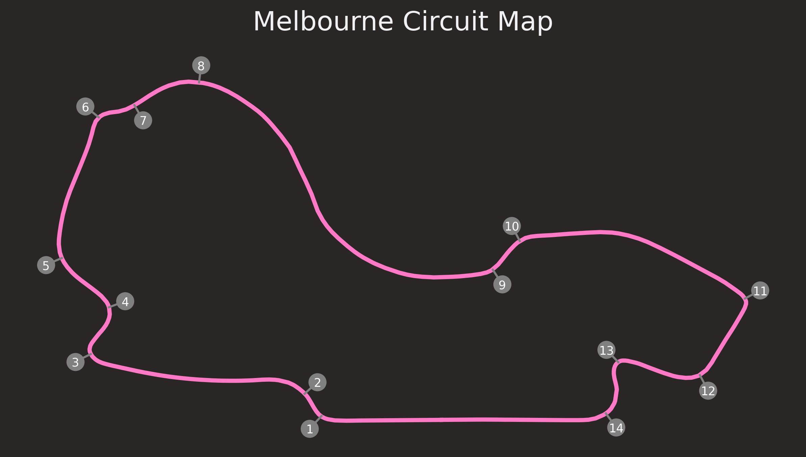
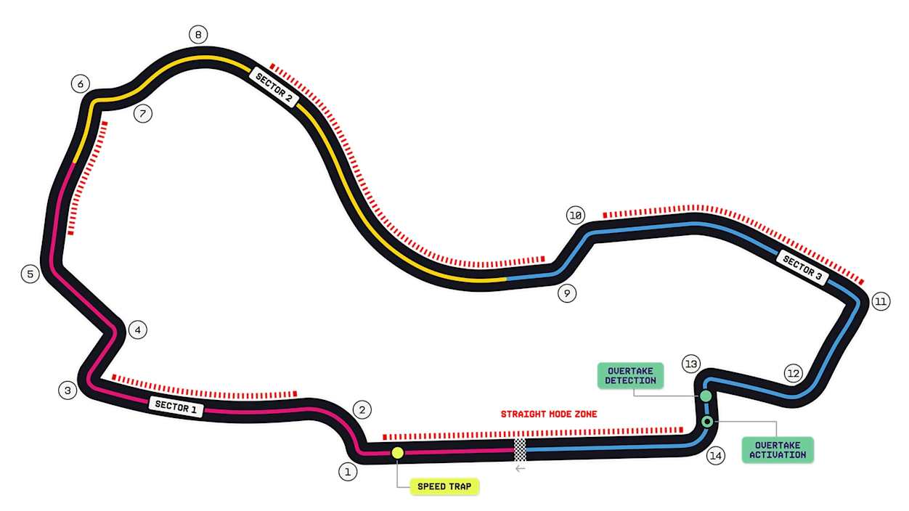
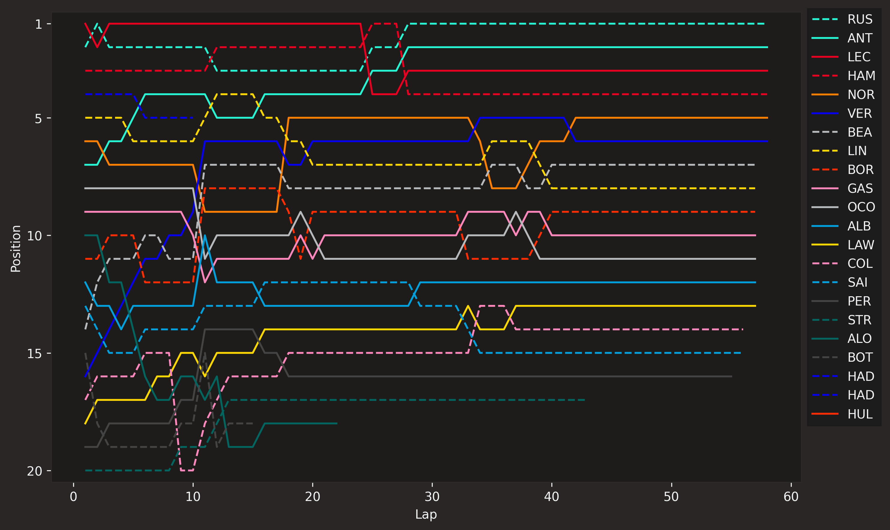
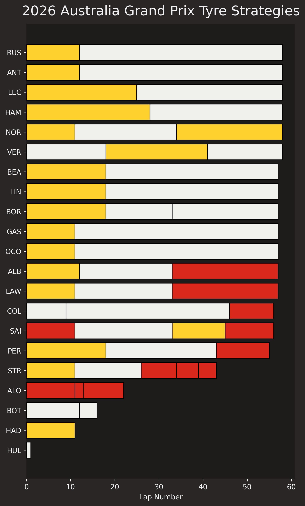
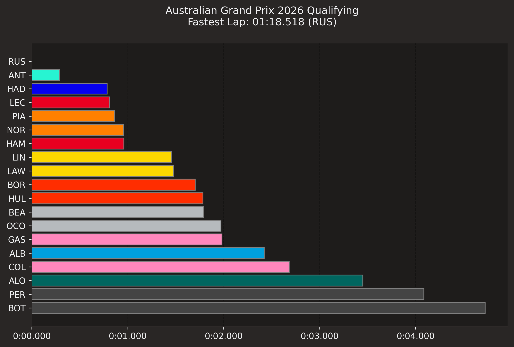
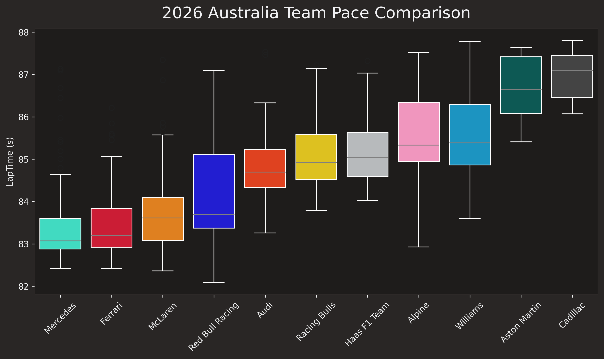

# Results report and analysis

## Table of contents
- [Results report and analysis](#results-report-and-analysis)
  - [Table of contents](#table-of-contents)
  - [General information](#general-information)
    - [Round 1 - Albert Park Grand Prix Circuit, Melbourne](#round-1---albert-park-grand-prix-circuit-melbourne)
    - [Weekend schedule](#weekend-schedule)
  - [Circuit](#circuit)
  - [Prediction](#prediction)
  - [Results](#results)
    - [Points](#points)
    - [Retirements](#retirements)
    - [Did Not Start](#did-not-start)
  - [Plots](#plots)
    - [Position changes during the race](#position-changes-during-the-race)
    - [Tyre strategy](#tyre-strategy)
    - [Qualifying results](#qualifying-results)
    - [Team pace comparison](#team-pace-comparison)

## General information
### Round 1 - Albert Park Grand Prix Circuit, Melbourne

Here are the general details of the first round of the 2026 Formula 1 season, held at the Albert Park Grand Prix Circuit in Melbourne, Australia:
* **Number of laps:** 58
* **Circuit length:** 5,303 km
* **Race distance:** 307,574 km

Here is a minimal image of the circuit layout with the location and the number of the corners:

### Weekend schedule
The weekend schedule for the Melbourne Grand Prix Circuit was as follows:
* **Practice 1:** 6 March, 12:30 PM - 13:30 PM
* **Practice 2:** 6 March, 16:00 PM - 17:00 PM
* **Practice 3:** 7 March, 12:30 PM - 13:30 PM
* **Qualifying:** 7 March, 16:00 PM - 17:00 PM
* **Race:** 8 March, 15:00 PM

## Circuit

The Race Park circuit Melbourne is 5,303 km long, with a total race distance of 307,574 km. 

The circuit is divided into **3 sectors**, **14 corners**, **5 Straight Mode Zones**. Before corner 1 there is a Speed Trap Zone; then, between corner 13 and 14 there are the Overtake Detection and the Overtake Activation.

With FIA regulations for 2026, there are no DRS zones anymore, but there are new features that are designed to promote overtaking. These are:

*  **Speed Trap Zone**: which is used to measure the top speed of the cars.
*  **Straight Mode Zones**: which are used to allow the cars to use their maximum power for a short period of time, usually on the straights.
*  **Overtake Detection**: which is used to detect when a car is attempting to overtake another car.
*  **Overtake Activation**: which is used to allow the cars to use their maximum power for a short period of time, usually when attempting to overtake another car.
  

*Source: https://www.formula1.com/en/racing/2026/australia*

## Prediction
[WORK IN PROGRESS]

## Results

### Points

| Pos | Driver                | Team         | Time / Status | Points |
| --- | --------------------- | ------------ | ------------- | ------ |
| 1   | George Russell        | Mercedes     | 1:23:06.801   | 25     |
| 2   | Andrea Kimi Antonelli | Mercedes     | +2.974s       | 18     |
| 3   | Charles Leclerc       | Ferrari      | +15.519s      | 15     |
| 4   | Lewis Hamilton        | Ferrari      | +16.144s      | 12     |
| 5   | Lando Norris          | McLaren      | +51.741s      | 10     |
| 6   | Max Verstappen        | Red Bull     | +59.000s      | 8      |
| 7   | Oliver Bearman        | Haas         | +1 lap        | 6      |
| 8   | Arvid Lindblad        | Racing Bulls | +1 lap        | 4      |
| 9   | Gabriel Bortoleto     | Audi         | +1 lap        | 2      |
| 10  | Pierre Gasly          | Alpine       | +1 lap        | 1      |
| 11  | Esteban Ocon          | Haas         | +1 lap        | 0      |
| 12  | Alexander Albon       | Williams     | +1 lap        | 0      |
| 13  | Liam Lawson           | Racing Bulls | +1 lap        | 0      |
| 14  | Franco Colapinto      | Alpine       | +1 lap        | 0      |
| 15  | Carlos Sainz          | Williams     | +1 lap        | 0      |
| 16  | Sergio Pérez          | Cadillac     | +3 laps       | 0      |

### Retirements

| Driver          | Team         | Reason |
| --------------- | ------------ | ------ |
| Lance Stroll    | Aston Martin | DNF    |
| Fernando Alonso | Aston Martin | DNF    |
| Valtteri Bottas | Cadillac     | DNF    |
| Isack Hadjar    | Red Bull     | DNF    |

### Did Not Start

| Driver          | Team    |
| --------------- | ------- |
| Oscar Piastri   | McLaren |
| Nico Hülkenberg | Audi    |

## Plots
### Position changes during the race

### Tyre strategy

### Qualifying results

### Team pace comparison

