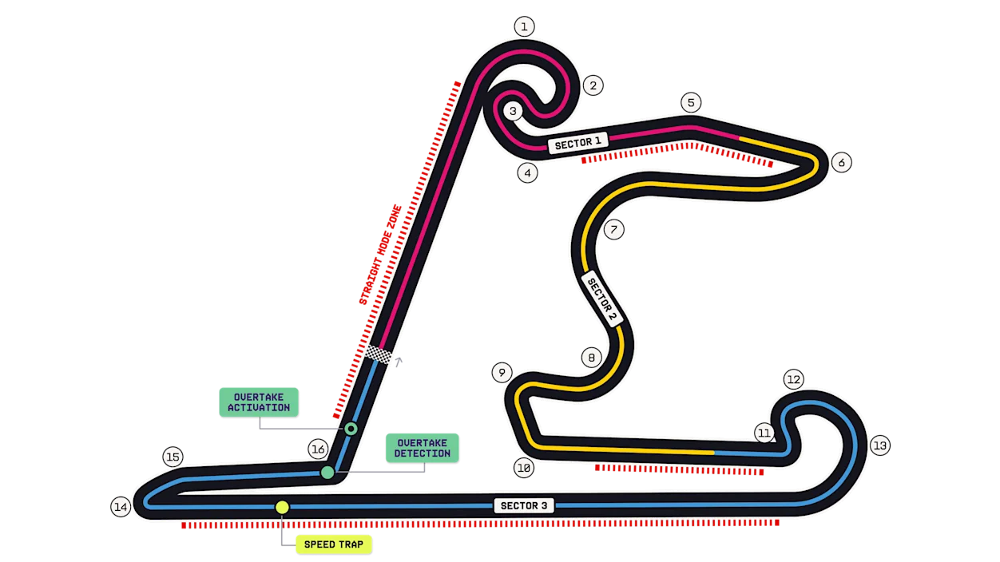
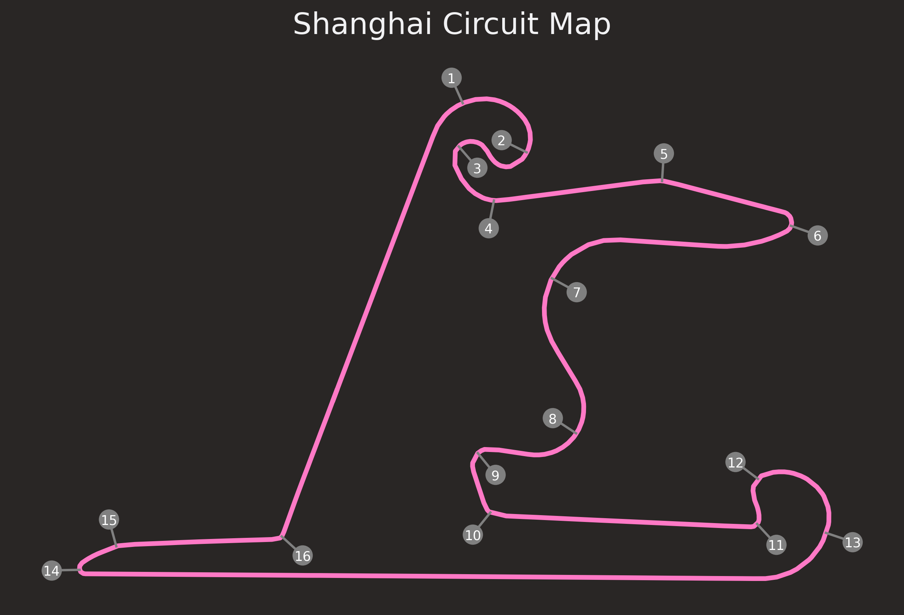
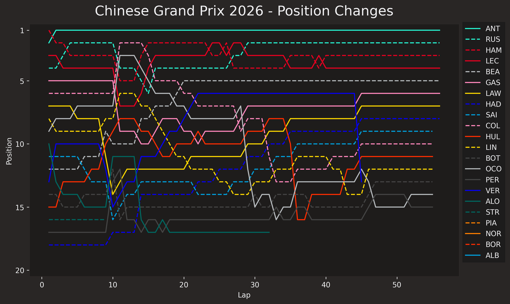
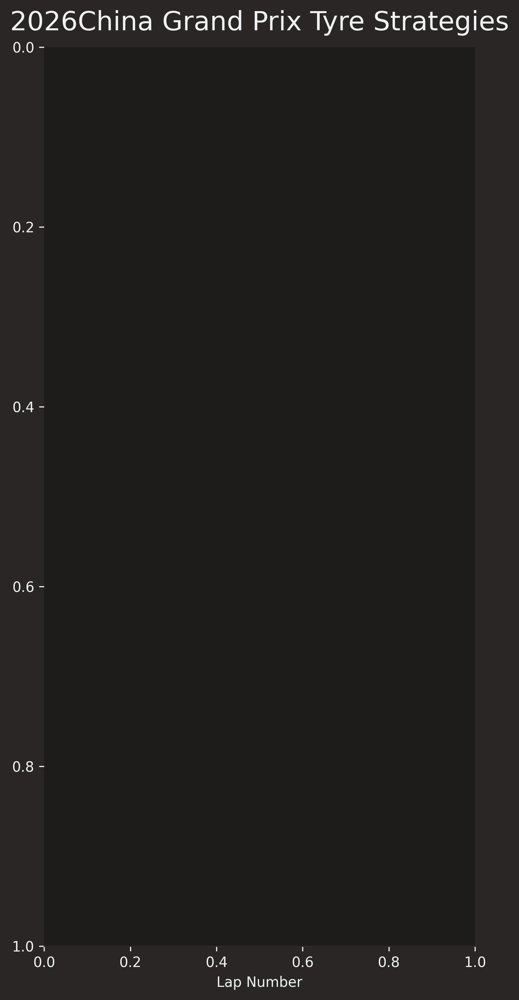
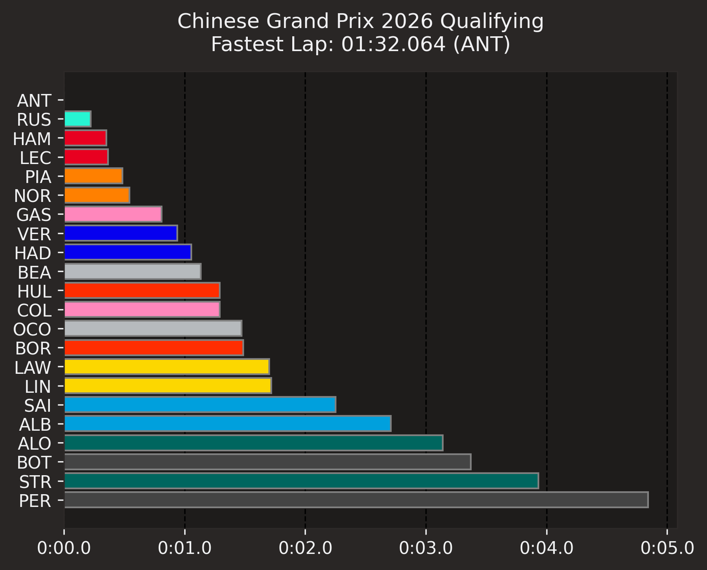
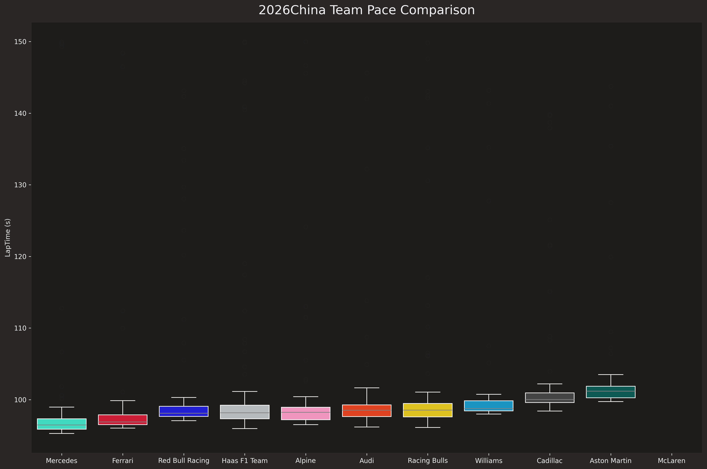

# Results report and analysis

## Table of contents
- [Results report and analysis](#results-report-and-analysis)
  - [Table of contents](#table-of-contents)
  - [General information](#general-information)
    - [Round 2 - Shanghai Grand Prix Circuit, China](#round-2---shanghai-grand-prix-circuit-china)
    - [Weekend schedule](#weekend-schedule)
  - [Circuit](#circuit)
  - [Prediction](#prediction)
  - [Results](#results)
    - [Points](#points)
    - [Retirements](#retirements)
    - [Did not start](#did-not-start)
  - [Plots](#plots)
    - [Position changes](#position-changes)
    - [Tyre strategy](#tyre-strategy)
    - [Qualifying results](#qualifying-results)
    - [Team pace comparison](#team-pace-comparison)

## General information
### Round 2 - Shanghai Grand Prix Circuit, China
### Weekend schedule

## Circuit

*Source: https://www.formula1.com/en/racing/2026/china*

## Prediction
[WORK IN PROGRESS]

## Results
### Points
### Retirements
### Did not start

## Plots

### Position changes

### Tyre strategy

### Qualifying results

### Team pace comparison
