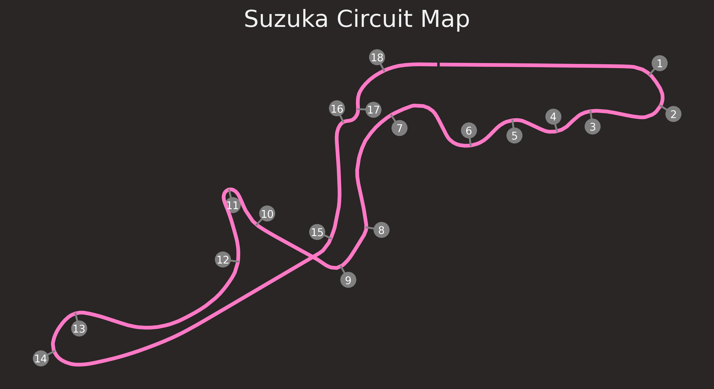
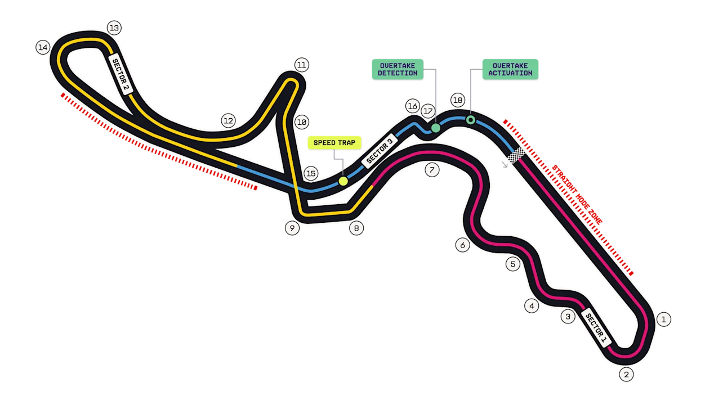
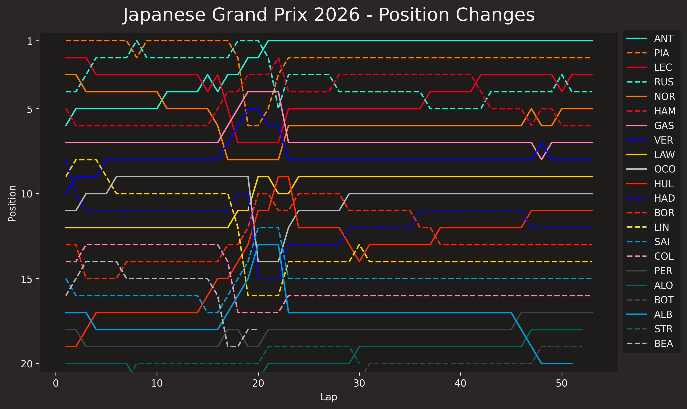
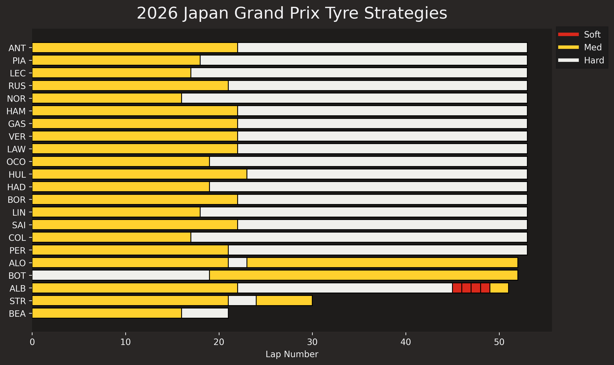
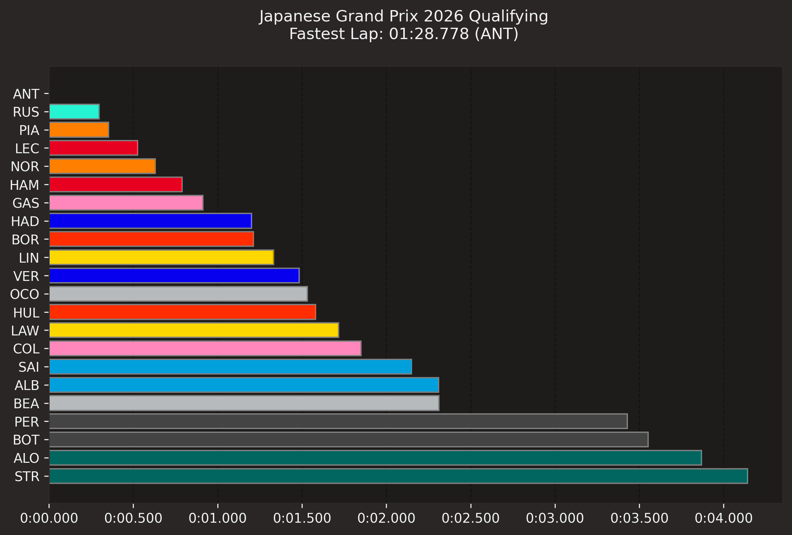
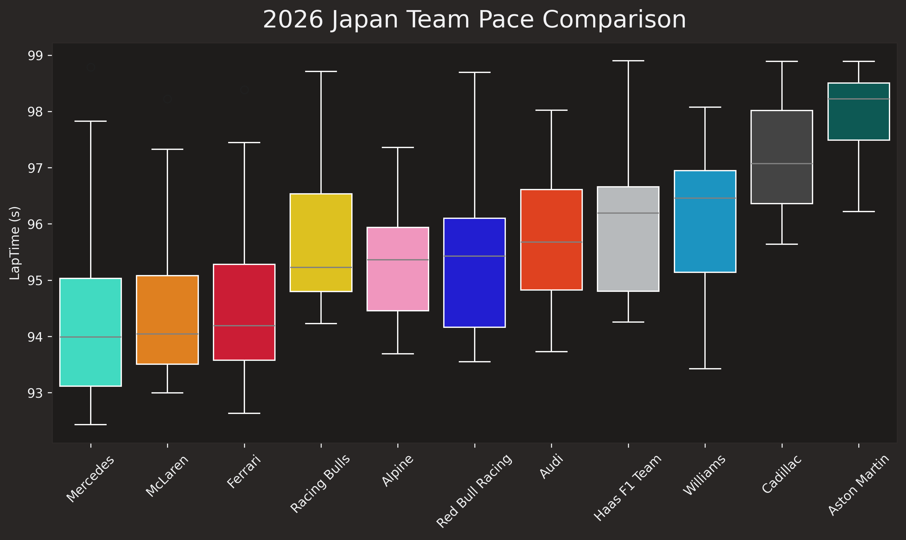

# Results report and analysis

## Table of contents
- [Results report and analysis](#results-report-and-analysis)
  - [Table of contents](#table-of-contents)
  - [General information](#general-information)
    - [Round 3 - Suzuka Grand Prix Circuit, Japan](#round-3---suzuka-grand-prix-circuit-japan)
    - [Weekend schedule](#weekend-schedule)
  - [Circuit](#circuit)
  - [Prediction](#prediction)
  - [Results](#results)
    - [Points](#points)
    - [Retirements](#retirements)
  - [Plots](#plots)
    - [Position changes](#position-changes)
    - [Tyre strategy](#tyre-strategy)
    - [Qualifying results](#qualifying-results)
    - [Team pace comparison](#team-pace-comparison)

## General information
### Round 3 - Suzuka Grand Prix Circuit, Japan
Here are the general details of the third round of the 2026 Formula 1 season, held at the Suzuka International Racing Course in Japan:

* **Number of laps**: 53
* **Circuit length**: 5.807 km
* **Race distance**: 307.471 km

Here is a minimal image of the circuit layout with the location and the number of the corners:
 

### Weekend schedule
The weekend schedule for the Suzuka International Racing Course was as follows:

* **Practice 1**: 27 March, 11:30 AM - 12:30 PM
* **Practice 2**: 27 March, 15:00 PM - 16:00 PM
* **Practice 3**: 28 March, 11:30 AM - 12:30 PM
* **Qualifying**: 28 March, 15:00 PM - 16:00 PM
* **Race**: 29 March, 14:00 PM

## Circuit
The Suzuka International Racing Course is 5.807 km long, with a total race distance of 307.471 km.

The circuit is famous for its unique "figure-eight" layout and is divided into **3 sectors**, **18 corners**, and **2 Straight Mode Zone**s. Before corner 16 there is a Speed Trap Zone; then, between corner 18 and corner 1 there is the Overtake Detection and the Overtake Activation on the main pit straight.

With FIA regulations for 2026, there are no DRS zones anymore, but there are new features that are designed to promote overtaking. These are:

* **Speed Trap Zone**: which is used to measure the top speed of the cars.
* **Straight Mode Zones**: which are used to allow the cars to use their maximum power for a short period of time, usually on the straights (notably the 130R approach).
* **Overtake Detection**: which is used to detect when a car is attempting to overtake another car.
* **Overtake Activation**: which is used to allow the cars to use their maximum power for a short period of time, usually when attempting to overtake another car.

*Source: https://www.formula1.com/en/racing/2026/japan*

## Prediction
The prediction model was developed using an **XGBoost Regressor** trained on data from the 2025 Japanese Grand Prix. The target variable is the **delta between race lap times and qualifying lap times**, focusing on degradation effects from fuel, tyres, and weather. 

**Key features** include qualifying time (`QualiTime_s`), lap number (`LapNumber`), tyre life (`TyreLife`), tyre compound encoded as an ID (`Compound_Id`), and **engineered variables**: fuel burn effect (`Fuel_Burn_Effect`, linear weight reduction over laps), tyre stress (`Tyre_Stress`, exponential degradation for high-speed tracks), and track-wind interaction (`Track_Wind_Interaction`, product of track temperature and wind speed). 

Additional **weather features** such as track temperature (`TrackTemp`), air temperature (`AirTemp`), wind speed (`WindSpeed`), and wind gust (`WindGust`) were incorporated where available. 

The model was trained with parameters including **2000 estimators**, a **learning rate of 0.008**, **max depth of 5**, and regularization to prevent overfitting, achieving a mean absolute error (MAE) of 0.4687 seconds on the validation set.

| Position | Driver | Predicted Race Lap |
| -------- | ------ | ------------------ |
| 1st      | ANT    | 91.480626          |
| 2nd      | RUS    | 91.765407          |
| 3rd      | PIA    | 91.707634          |
| 4th      | NOR    | 91.810304          |
| 5th      | LEC    | 91.972367          |
| 6th      | HAM    | 92.042582          |
| 7th      | GAS    | 92.363678          |
| 8th      | HAD    | 92.571612          |
| 9th      | BOR    | 92.867612          |
| 10th     | LIN    | 92.912612          |

**Model Performance:** MAE (Mean Absolute Error) = 0.4687s

## Results
### Points

| Pos | Driver                | Team         | Time / Status | Points |
| --- | --------------------- | ------------ | ------------- | ------ |
| 1   | Andrea Kimi Antonelli | Mercedes     | 1:28:03.403   | 25     |
| 2   | Oscar Piastri         | McLaren      | +13.722s      | 18     |
| 3   | Charles Leclerc       | Ferrari      | +15.270s      | 15     |
| 4   | George Russell        | Mercedes     | +15.754s      | 12     |
| 5   | Lando Norris          | McLaren      | +23.479s      | 10     |
| 6   | Lewis Hamilton        | Ferrari      | +25.037s      | 8      |
| 7   | Pierre Gasly          | Alpine       | +32.340s      | 6      |
| 8   | Max Verstappen        | Red Bull     | +32.677s      | 4      |
| 9   | Liam Lawson           | Racing Bulls | +50.180s      | 2      |
| 10  | Esteban Ocon          | Haas         | +51.216s      | 1      |
| 11  | Nico Hülkenberg       | Audi         | +52.280s      | 0      |
| 12  | Isack Hadjar          | Red Bull     | +56.154s      | 0      |
| 13  | Gabriel Bortoleto     | Audi         | +59.078s      | 0      |
| 14  | Arvid Lindblad        | Racing Bulls | +59.848s      | 0      |
| 15  | Carlos Sainz          | Williams     | +1:05.008s    | 0      |
| 16  | Franco Colapinto      | Alpine       | +1:05.773s    | 0      |
| 17  | Sergio Pérez          | Cadillac     | +1:32.453s    | 0      |
| 18  | Fernando Alonso       | Aston Martin | +1 lap        | 0      |
| 19  | Valtteri Bottas       | Cadillac     | +1 lap        | 0      |
| 20  | Alexander Albon       | Williams     | +2 laps       | 0      |

### Retirements
| Driver         | Team         | Reason                  |
| -------------- | ------------ | ----------------------- |
| Oliver Bearman | Haas         | DNF (Accident - Lap 22) |
| Lance Stroll   | Aston Martin | DNF (Water Pressure)    |

## Plots

### Position changes

### Tyre strategy

### Qualifying results

### Team pace comparison
