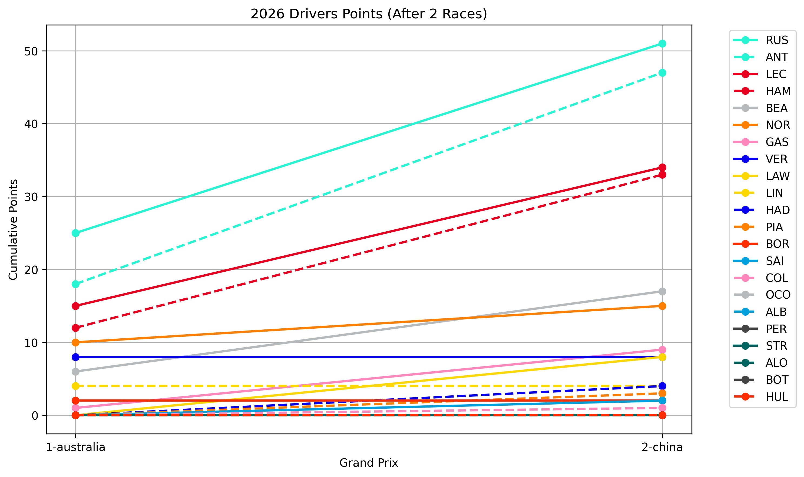
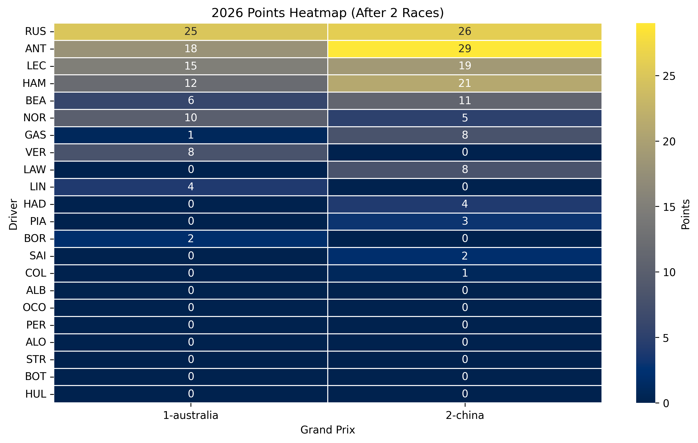
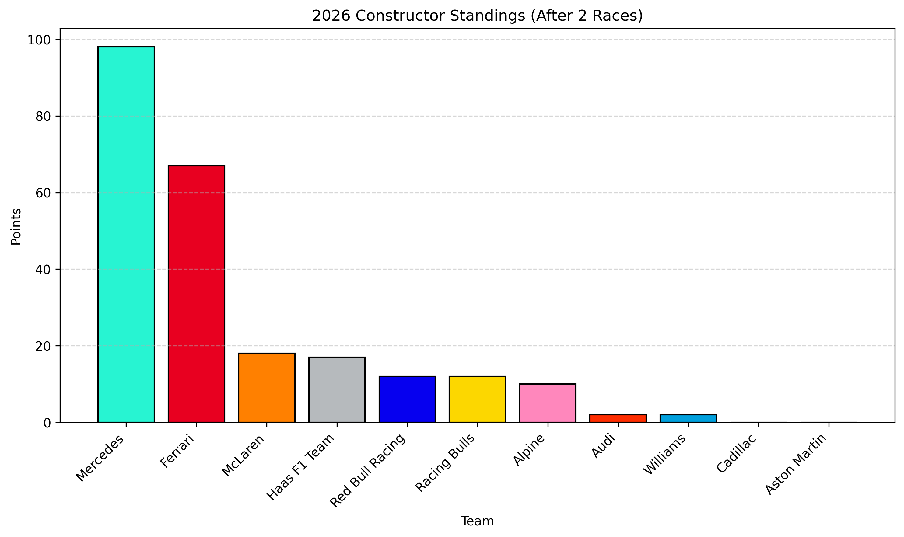

# 2026 Season summary

The 2026 Formula 1 season has just started, more informations will be provided in the future, by keeping updated this page with the results of each Grand Prix, the points tally and the championship battle.

Here are shown some general informations about the season:
* **22 full-time pilots**
* **11 teams**
* **24 races**
  

## Race Results

This section will be updated weekly with the results of each Grand Prix, including the winner and cumulative points for Drivers.

This table below will be filled with the winner of each GP. In addiction to this, a cumulative points graph will br e added to show the progression of the championship battle throughout the season.

| Round | Grand Prix          | Date        | Winner    |
| :---- | :------------------ | :---------- | :-------- |
| 1     | Australian GP       | 08 Mar 2026 | Russel    |
| 2     | Chinese GP          | 15 Mar 2026 | Antonelli |
| 3     | Japanese GP         | 29 Mar 2026 | TBD       |
| 4     | Bahrain GP          | 12 Apr 2026 | TBD       |
| 5     | Saudi Arabian GP    | 19 Apr 2026 | TBD       |
| 6     | Miami GP            | 03 May 2026 | TBD       |
| 7     | Canadian GP         | 24 May 2026 | TBD       |
| 8     | Monaco GP           | 07 Jun 2026 | TBD       |
| 9     | Spanish GP          | 14 Jun 2026 | TBD       |
| 10    | Austrian GP         | 28 Jun 2026 | TBD       |
| 11    | British GP          | 05 Jul 2026 | TBD       |
| 12    | Belgian GP          | 19 Jul 2026 | TBD       |
| 13    | Hungarian GP        | 26 Jul 2026 | TBD       |
| 14    | Dutch GP            | 23 Aug 2026 | TBD       |
| 15    | Italian GP          | 06 Sep 2026 | TBD       |
| 16    | Spanish GP (Madrid) | 13 Sep 2026 | TBD       |
| 17    | Azerbaijan GP       | 26 Sep 2026 | TBD       |
| 18    | Singapore GP        | 11 Oct 2026 | TBD       |
| 19    | United States GP    | 25 Oct 2026 | TBD       |
| 20    | Mexico City GP      | 01 Nov 2026 | TBD       |
| 21    | São Paulo GP        | 08 Nov 2026 | TBD       |
| 22    | Las Vegas GP        | 21 Nov 2026 | TBD       |
| 23    | Qatar GP            | 29 Nov 2026 | TBD       |
| 24    | Abu Dhabi GP        | 06 Dec 2026 | TBD       |

### Cumulative graph of points
This graph will be updated after each race to show the progression of the championship battle throughout the season. It will display the cumulative points for each driver after each Grand Prix, allowing us to visualize how the standings evolve over time.

### Victory Tally

This table below shows the cumulative points for few selected drivers. it will be updated.

| Driver                | Team     | Points |
| --------------------- | -------- | ------ |
| George Russell        | Mercedes | 51     |
| Andrea Kimi Antonelli | Mercedes | 47     |
| Charles Leclerc       | Ferrari  | 34     |
| Lewis Hamilton        | Ferrari  | 33     |
| Lando Norris          | McLaren  | 15     |
| Max Verstappen        | Red Bull | 8      |
| Oscar Piastri         | McLaren  | 3      |

With respect to last season, due to the changing FIA regulations, Max Verstappen is not been able to dominate the championship as he did in the previous years. Also Oscar Piastri and Lando Norris, who dominated the 2025 season, with a strong McLaren car, have not been able to keep up with the pace of the Mercedes and Ferrari cars.
George Russell and Andrea Kimi Antonelli are showing a strong performance, leading the championship battle. Charles Leclerc and Lewis Hamilton are also closely following, making the 2026 season highly competitive and exciting to watch.

Together with the points tally, below a thermal map of the points distribution among the drivers is shown, with the top 10 drivers highlighted.

## Teams and drivers

The 2026 grid features a mix of experienced champions and emerging new talents. Several changes were introduced with the new regulations, including the arrival of new manufacturers and teams such as Audi and Cadillac. Established teams like Ferrari, McLaren, Mercedes, and Red Bull continue to lead the competition while the midfield remains highly competitive.

| Team                       | Driver #1       | Driver #2             |
| -------------------------- | --------------- | --------------------- |
| **McLaren**                | Lando Norris    | Oscar Piastri         |
| **Mercedes AMG Petronas**  | George Russell  | Andrea Kimi Antonelli |
| **Oracle Red Bull Racing** | Max Verstappen  | Isack Hadjar          |
| **Scuderia Ferrari**       | Charles Leclerc | Lewis Hamilton        |
| **Aston Martin**           | Fernando Alonso | Lance Stroll          |
| **BWT Alpine**             | Pierre Gasly    | Franco Colapinto      |
| **TGR Haas**               | Esteban Ocon    | Oliver Bearman        |
| **Racing Bulls**           | Liam Lawson     | Arvid Lindblad        |
| **Williams**               | Alexander Albon | Carlos Sainz          |
| **Audi**                   | Nico Hülkenberg | Gabriel Bortoleto     |
| **Cadillac**               | Sergio Pérez    | Valtteri Bottas       |

Here below a graph showing the constructor points distribution for the teams. This graph will be updated after each race.

